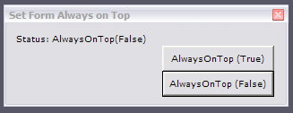



## BalPoint Form AlwaysOnTop

### Description

Set your form 'Always On Top' - > On Top of other windows.
 
### More Info
 
1)MakeAlwaysOnTop Me,True

2)MakeAlwaysOnTop Me,False

Just include the module in your projects and presto!

1)Form is Always on Top

2)Form is NOT! Always on Top

             |
---                |---
**Submitted On**   |2002-11-03 09:47:00
**By**             |[darklordz](https://github.com/Planet-Source-Code/PSCIndex/blob/master/ByAuthor/darklordz.md)
**Level**          |Beginner
**User Rating**    |4.0 (28 globes from 7 users)
**Compatibility**  |VB 4\.0 \(16\-bit\), VB 4\.0 \(32\-bit\), VB 5\.0, VB 6\.0
**Category**       |[VB function enhancement](https://github.com/Planet-Source-Code/PSCIndex/blob/master/ByCategory/vb-function-enhancement__1-25.md)
**World**          |[Visual Basic](https://github.com/Planet-Source-Code/PSCIndex/blob/master/ByWorld/visual-basic.md)
**Archive File**   |[BalPoint\_F15020811222002\.zip](https://github.com/Planet-Source-Code/darklordz-balpoint-form-alwaysontop__1-40367/archive/master.zip)

